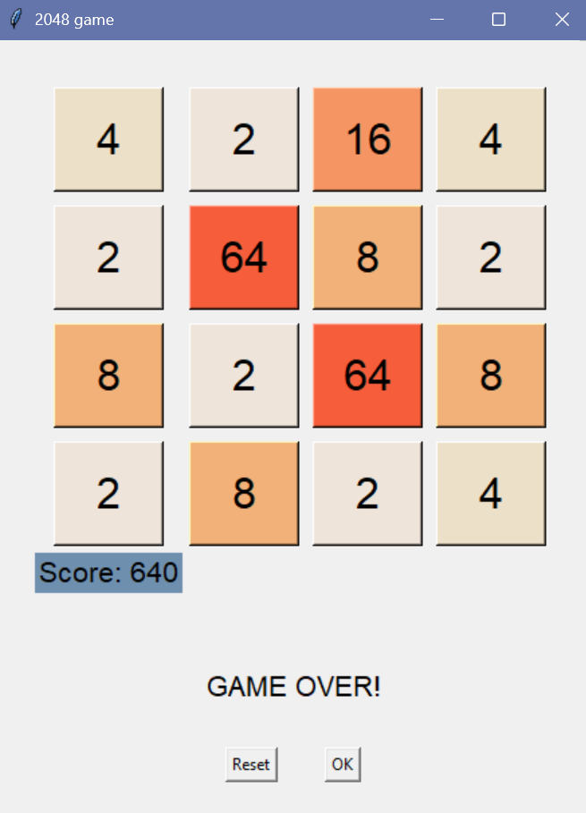

# 2048 game using Python and Tkinter GUI.

## Game Preview:

## Logic + Design:

- Simple and clean interface using tkinter
- Supports all arrow key movements (up, down, left, right)
- Tile values double on merge (e.g. 2 + 2 = 4)
- Dynamic score tracking
- Game Over detection with a reset or exit option

## How to run:

- Clone the repository
- Run using python 2048.py
- Use the arrow keys to move the tiles.
